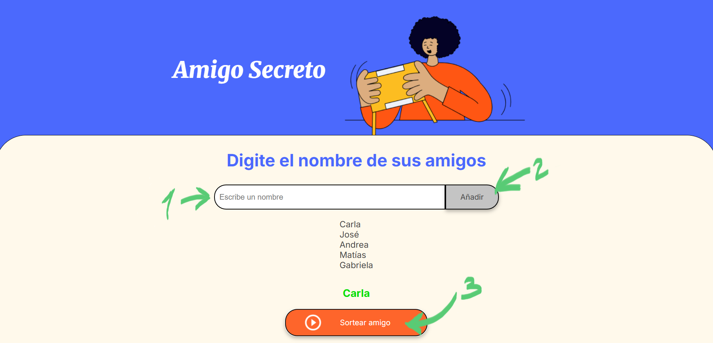

<h1 align="center"> DESAFÍO AMIGO SECRETO </h1>
<h2 align="center">:heavy_check_mark: EN FUNCIONAMIENTO :heavy_check_mark:</h2>

Este es el Challenge Amigo Secreto, desarrollado como parte del curso Alura Latam One (Lógica de Programación). La página permite realizar un sorteo aleatorio de nombres para determinar el amigo secreto de cada participante.

## Funcionalidad
La aplicación web permite a los usuarios:

1. `Agregar Participantes (Amigos)`: 
- Un campo de texto permite al usuario escribir el nombre de un amigo.
- Al clickear en Añadir, se agrega el nombre a la lista de participantes.
- Se valida que el campo de texto (Escribe un nombre) no esté vacío, alertando al usuario si intenta añadir un campo en blanco.
- La lista de amigos agregados es visible, de modo que el usuario puede ver quiénes están participando.
  
2. `Realizar sorteo aleatorio`:
- Al hacer click en "Sortear amigo" la aplicación selecciona un nombre al azar de la lista de participantes.
- Se valida que haya al menos un nombre en la lista antes de intentar sortear.
- El nombre del amigo seleccionado se muestra de forma distintiva en la página.
  

### :wrench: Requisitos 
Para visualizar y utilizar esta aplicación web, solo necesitas:

A) `Un navegador web moderno (ej. Google Chrome, Mozilla Firefox, Microsoft Edge, Safari)`

B) `**Opcional** Si deseas inspeccionar o modificar el código, necesitarás un editor de texto o IDE. En este caso, el código se trabajó en Visual Studio Code`

C) `**Opcional** Para clonar el repositorio y obtener una copia local del proyecto, necesitarás tener Git instalado.`

### :arrow_forward: Cómo Usar la Aplicación
1. `Abrir la aplicación:`
    - Descarga este repositorio o clónalo a tu máquina local. Luego, abre el archivo index.html directamente en tu navegador web.
      
2. `Agregar Nombres:`
    - Localiza el campo de texto etiquetado como _"Escribe un nombre"_.
    - Escribe el nombre de cada persona que participará en el sorteo.
    - Haz clic en el botón _"Añadir"_ después de cada nombre. Los nombres se irán listando en la sección de amigos agregados.
      
3. `Realizar el Sorteo:`
    - Una vez que todos los participantes hayan sido agregados (se recomienda un mínimo de dos personas para un sorteo significativo), haz clic en el botón _"Sortear amigo"_.
    - La aplicación seleccionará un nombre aleatorio de la lista y lo mostrará en el área de resultados.

### :ballot_box_with_check: Acceso a la página
https://4527-priscilla.github.io/Challenge-Amigo-Secreto/
